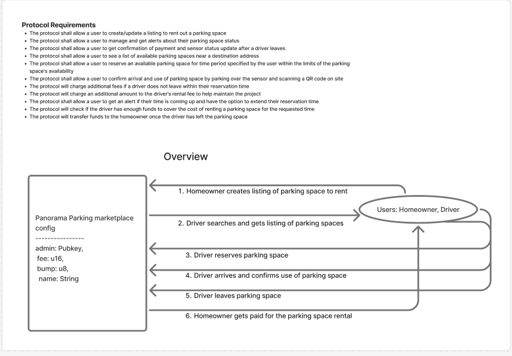

# Panorama Parking
### [Web app](https://depin-parking.vercel.app)

<div align="center">
  
</div>

> **Revolutionizing Parking with Decentralized Infrastructure and Smart Contracts**

[](https://solana.com/)
[](https://www.anchor-lang.com/)
[](https://www.rust-lang.org/)
[](https://reactjs.org/)
[](https://nextjs.org/)
[](https://reactnative.dev/)
[](https://www.typescriptlang.org/)
[](https://www.mongodb.com/)

## 📖 Overview

Panorama Parking is a decentralized parking marketplace built on Solana that leverages LoRaWAN sensors and blockchain technology to create an efficient, transparent, and user-friendly parking ecosystem. The platform allows users to list, discover, and reserve parking spaces while providing real-time availability updates through sensor integration.

## ✨ Features

- 🏠 **Smart Parking Listings**: Create and manage parking space listings with detailed information
- ⏰ **Real-time Availability**: Availability windows with start/end timestamps
- 🔔 **Multi-channel Notifications**: App, email, and phone notification preferences
- 📱 **Cross-platform App**: React Native app with web compatibility
- 🔗 **LoRaWAN Sensor Integration**: Parking status updates via Switchboard feeds
- 🚀 **Solana Blockchain**: Fast, low-cost transactions with high throughput

## 🏗️ Architecture

The project consists of three main components:

### 1. Solana Smart Contracts (`anchor-panorama-parking/`)
- **Program ID**: `FXUQwDsKJNrYFsfiUokPbH4BSrZtoC9m8HpoiMvYxtSE`
- https://explorer.solana.com/address/FXUQwDsKJNrYFsfiUokPbH4BSrZtoC9m8HpoiMvYxtSE?cluster=devnet
- **Framework**: Anchor Framework
- **IDL**: https://explorer.solana.com/address/FXUQwDsKJNrYFsfiUokPbH4BSrZtoC9m8HpoiMvYxtSE/idl?cluster=devnet

#### Core Instructions:
- `initialize`: Initialize the marketplace with name and fee structure
- `list`: Create new parking space listings
- `update_listing`: Modify existing listing details
- `delete_listing`: Remove parking space listings
- `set_notification_settings`: Configure user notification preferences
- `add_feed_to_listing`: Integrate Lorawan sensor feed
- `confirm_parking`: Confirm parking space reservations
- `reserve`: Reserve parking spaces

### 2. React Native Web App (`panorama-parking-react-native-web/`) (coming soon)
- Cross-platform mobile and web application
- Built with React Native Web for universal compatibility
- Next.js integration for optimal web performance

### 3. Sensor Integrations
#### LoRaWAN 
<div align="center">
  
</div>

- Dragino DS20L sensor
- https://www.meteoscientific.com/docs/tutorial-basics/LoRaWAN-Big-Picture
- **Switchboard Feeds**: Oracle integration
- https://docs.switchboard.xyz/product-documentation/data-feeds
- **Mock Car Arrival Feed**: `J748azokS8cKaiGKgN5hsTsTuB1FJ1ikVNXKjq9DQnjg`
- https://ondemand.switchboard.xyz/solana/devnet/feed/J748azokS8cKaiGKgN5hsTsTuB1FJ1ikVNXKjq9DQnjg
- **Mock Car Departure Feed**: `9jfL52Gmudwee1RK8yuNguoZET7DMDqKSR6DePBJNXot`
- https://ondemand.switchboard.xyz/solana/devnet/feed/9jfL52Gmudwee1RK8yuNguoZET7DMDqKSR6DePBJNXot

#### ESP32 w/ proximity sensor (in development)

#### Raspberry Pi 5 (in development)
- YOLO software for AI object detection
- can detect if car leaves and arrives


## 📊 Architecture Diagram

<div align="center">
  
</div>


## 👥 User Stories

*Coming Soon: Detailed user stories for different user types including parking space owners, renters, and administrators*

## 🎥 Demo Videos

*Coming Soon: Step-by-step demo videos for each user flow including:*
- *Parking space listing creation*
- *Space discovery and reservation*
- *Real-time sensor updates*
- *Payment processing*
- *Mobile app usage*

## 🚀 Upcoming Features

### MagicBlock Integration
*Coming Soon: Integration with [MagicBlock Engine](https://docs.magicblock.gg/pages/get-started/use-cases/depin) for enhanced DePIN capabilities*


### Governance

### Data Management/Storage
- https://www.termina.technology/post/comparing-on-chain-proof-storage-options-for-depin
- "Why Proof Storage Matters

  The question of on-chain versus off-chain proof storage is ultimately about trust, how it is established, maintained, and transferred between different stakeholders.

  In data-centric DePINs, trust must be projected outward to enterprise customers, auditors, or regulators who did not directly witness the activity that generated value. These stakeholders rely on immutable, independently verifiable records to confirm that claims are legitimate and untampered. On-chain proofs provide exactly this: a transparent, lasting audit trail that anyone can check, now or years into the future.

  In contrast, service-focused DePINs provide live access to resources such as computation or bandwidth, where users themselves experience and verify the outcome in real time."

### Hardware security

### Token Rewards/Distribution

### Testing frameworks


## 🚀 Getting Started

### Prerequisites
- https://solana.com/docs/intro/installation
- Node.js 
- Yarn
- Rust
- Solana CLI tools
- Anchor Framework

### Installation

1. **Clone the repository**
   ```bash
   git clone https://github.com/hsien-hsiuliao/DePIN-Panorama-Parking.git
   cd DePIN-Panorama-Parking
   ```

2. **Install dependencies**
   ```bash
   # Install Anchor program dependencies
   cd anchor-panorama-parking
   anchor build
   
   # Install React Native app dependencies
   cd ../panorama-parking-react-native-web
   yarn install
   ```


3. **Run the application**
   ```bash
   cd ../panorama-parking-react-native-web
   yarn dev
   ```

## 🔧 Development

### Smart Contract Development
```bash
cd anchor-panorama-parking
anchor build
anchor test
```

### Frontend Development
```bash
cd panorama-parking-react-native-web
yarn dev             # Development server
yarn build           # Production build
yarn start           # Production server
```

## 📱 Mobile App

<div align="center">
  
  <p><em>Scan to download the Android APK</em></p>
</div>


## 🧪 Testing

Run the comprehensive test suite:
```bash
cd anchor-panorama-parking
anchor test
```

The test suite includes examples of:
- Creating parking listings
- Updating listing information
- Managing notification settings
- Sensor feed integration
- Parking confirmations and reservations


## 🏆 Hackathon Submissions


### Breakout Hackathon
- **Event**: https://www.colosseum.com/breakout
- **Focus**: DePIN 

### Solana Mobile Hackathon
- **Event**: https://solanamobile.radiant.nexus/
- **Focus**: Mobile-first blockchain applications and Solana Mobile Stack integration


---

<div align="center">
  <p><strong>Developed during <a href=https://www.turbin3.org/>Turbin3</a> Builders programs</strong></p>
  <p><em>2025</em></p>
</div>